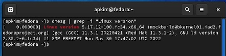
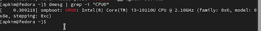
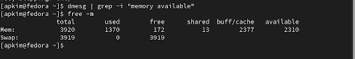
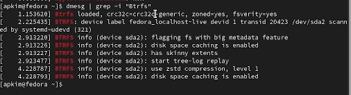
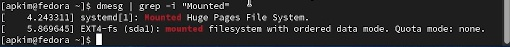

---
## Front matter
lang: ru-RU
title: Отчет по лабораторной работе №1
subtitle: Установка OC Linux
author:
  - Ким А.П.
institute:
  - Российский университет дружбы народов, Москва, Россия
  - Объединённый институт ядерных исследований, Дубна, Россия
date: 18 февраля 2023

## i18n babel
babel-lang: russian
babel-otherlangs: english

## Formatting pdf
toc: false
toc-title: Содержание
slide_level: 2
aspectratio: 169
section-titles: true
theme: metropolis
header-includes:
 - \metroset{progressbar=frametitle,sectionpage=progressbar,numbering=fraction}
 - '\makeatletter' 
 - '\beamer@ignorenonframefalse'
 - '\makeatother'
---

## Докладчик

:::::::::::::: {.columns align=center}
::: {.column width="70%"}

  * Ким Ангелина Павловна
  * студент
  * направление "Математика и механика"
  * Российский университет дружбы народов

:::
::: {.column width="30%"}

:::
::::::::::::::

# Элементы презентации

## Цели и задачи
Приобретение практических навыков установки операционной системы на виртуальную машину, настройки минимально необходимых для дальнейшей работы сервисов.

## Выполнение работы

Так как виртуальная машина уже была установлена в прошлом семестре, в этом отчете представлено просто выполнение домашней работы. Для того чтобы найти нужную информацию, воспользуемся командой grep. Для того чтобы найти версию ядра, нам нужно ввести: (рис. 1).

## Выполнение работы

Для того чтобы найти частоту процессора, нам нужно ввести: (рис. 2).

## Выполнение работы

Для того чтобы найти модель процессора, нам нужно ввести: (рис. 3).

## Выполнение работы

Для того чтобы найти объем доступной оперативной памяти, нам нужно ввести: (рис. 4).

## Выполнение работы

Для того чтобы найти тип обнаруженного гипервизора, нам нужно ввести: (рис. 5).

## Выполнение работы

Для того чтобы найти тип файловой системы корневого раздела, нам нужно ввести: (рис. 6.).

## Выполнение работы

Для того чтобы найти последовательность монтирования файловых систем, нам нужно ввести: (рис. 7).

## Итоговый слайд

В ходе данной лабораторной работы мы вспомнили практические навыки установки операционной системы на виртуальную машину, настроили необходимые сервисы, нашли нужную информацию.

:::

