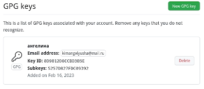

---
## Front matter
lang: ru-RU
title: Отчет по лабораторной работе №2
subtitle: Первоначальная настройка git
author:
  - Ким А.П.
institute:
  - Российский университет дружбы народов, Москва, Россия
  - Объединённый институт ядерных исследований, Дубна, Россия
date: 18 февраля 2023 год

## i18n babel
babel-lang: russian
babel-otherlangs: english

## Formatting pdf
toc: false
toc-title: Содержание
slide_level: 2
aspectratio: 169
section-titles: true
theme: metropolis
header-includes:
 - \metroset{progressbar=frametitle,sectionpage=progressbar,numbering=fraction}
 - '\makeatletter'
 - '\beamer@ignorenonframefalse'
 - '\makeatother'
---

# Информация

## Докладчик

:::::::::::::: {.columns align=center}
::: {.column width="70%"}

  * Ким Ангелина Павловна
  * студент
  * направление "Математика и механика"
  * Российский университет дружбы народов

:::
::: {.column width="30%"}

:::
::::::::::::::

# Вводная часть

## Цели и задачи

Изучить идеологию и применение средств контроля версий, освоить умения по работе с git.

## Выполнение работы 

Для начала установим git (рис.1)

## Выполнение работы 

Далее настроим git (рис.2)

## Выполнение работы 

Продолжение настройки git (рис.3)

## Выполнение работы 

Следующим шагом создаем ключи SSH (рис.4)

## Выполнение работы 

Далее создаем ключ PGP (рис.5)

## Выполнение работы 

Теперь добавляем PGP ключ на GitHub (рис.6)

## Выполнение работы 

Далее настраиваем автоматические подписи коммитов git (рис.7)

## Выполнение работы 

Далее создаем репозиторий курса на основе шаблона (рис.8)

## Выполнение работы 

Теперь настраиваем каталог курса (рис.9)

## Выполнение работы 

В заключение отправляем файлы на сервер (рис.10)

## Вывод

В ходе данной лабораторной работы мы изучили идеологию и применение средств контроля версий, освоили умения по работе с git.

:::

