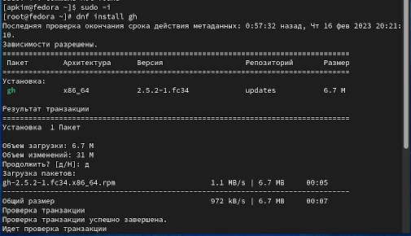

---
## Front matter
title: "Отчет по лабораторной работе №2"
subtitle: "Первоначальная настройка git"
author: "Ангелина Павловна Ким"

## Generic otions
lang: ru-RU
toc-title: "Содержание"

## Bibliography
bibliography: bib/cite.bib
csl: pandoc/csl/gost-r-7-0-5-2008-numeric.csl

## Pdf output format
toc: true # Table of contents
toc-depth: 2
lof: true # List of figures
lot: true # List of tables
fontsize: 12pt
linestretch: 1.5
papersize: a4
documentclass: scrreprt
## I18n polyglossia
polyglossia-lang:
  name: russian
  options:
	- spelling=modern
	- babelshorthands=true
polyglossia-otherlangs:
  name: english
## I18n babel
babel-lang: russian
babel-otherlangs: english
## Fonts
mainfont: PT Serif
romanfont: PT Serif
sansfont: PT Sans
monofont: PT Mono
mainfontoptions: Ligatures=TeX
romanfontoptions: Ligatures=TeX
sansfontoptions: Ligatures=TeX,Scale=MatchLowercase
monofontoptions: Scale=MatchLowercase,Scale=0.9
## Biblatex
biblatex: true
biblio-style: "gost-numeric"
biblatexoptions:
  - parentracker=true
  - backend=biber
  - hyperref=auto
  - language=auto
  - autolang=other*
  - citestyle=gost-numeric
## Pandoc-crossref LaTeX customization
figureTitle: "Рис."
tableTitle: "Таблица"
listingTitle: "Листинг"
lofTitle: "Список иллюстраций"
lotTitle: "Список таблиц"
lolTitle: "Листинги"
## Misc options
indent: true
header-includes:
  - \usepackage{indentfirst}
  - \usepackage{float} # keep figures where there are in the text
  - \floatplacement{figure}{H} # keep figures where there are in the text
---

# Цель работы

Изучить идеологию и применение средств контроля версий. Освоить умения по работе с git.

# Задание

1. Создать базовую конфигурацию для работы с git.
2. Создать ключ SSH.
3. Создать ключ PGP.
4. Настроить подписи git.
5. Зарегистрироваться на Github.
6. Создать локальный каталог для выполнения заданий по предмету.

# Выполнение лабораторной работы

Для начала установим git (рис. @fig:001).

{#fig:001 width=70%}

Далее зададим имя и почту владельца репозитория, а затем настроим utf-8 в выводе сообщений git (рис. @fig:002).

{#fig:002 width=70%}

Следующим шагом настроим верификацию и подписание коммитов git. Сначала зададим имя начальной ветки, потом параметр autocrlf, а затем параметр safecrlf (рис. @fig:003).

{#fig:003 width=70%}

Далее нам нужно создать SSH ключи. По алгоритму rsa с ключем размером 4096 бит, по алгоритму ed25519 (рис. @fig:004).

{#fig:004 width=70%}

Теперь создаем ключи pgp. Сначала генерируем ключ. Затем из предложенных опций выбираем то, что нужно. (рис. @fig:005).

{#fig:005 width=70%}

Продолжение опций (рис. @fig:006).

{#fig:006 width=70%}

Далее выводим список ключей и копируем отпечаток приватного ключа. Затем копируем сгенерированный pgp ключ и вставляем его на github. (рис. @fig:007).

{#fig:007 width=70%}

Ключ присоединился (рис. @fig:008).

{#fig:008 width=70%}

Следующим шагом нужно, используя введенную почту, указать Git и применять его при подписи коммитов (рис. @fig:009).

{#fig:009 width=70%}

Далее необходимо авторизоваться, отвечая на вопросы (рис. @fig:0010).

{#fig:0010 width=70%}

Успешное подсоединение (рис. @fig:0011).

{#fig:0011 width=70%}

Теперь нам нужно создать репозиторий на основе шаблона  (рис. @fig:0012).

{#fig:0012 width=70%}

Продолжение (рис. @fig:0013).

{#fig:0013 width=70%}

Теперь нам нужно настроить каталог курса. Сначала переходим в каталог курса, затем удаляем лишние файлы и создаем необходимые каталоги (рис. @fig:0014).

{#fig:0014 width=70%}

Отправляем файлы на сервер  (рис. @fig:0015).

{#fig:0015 width=70%}

Продолжение (рис. @fig:0016).

{#fig:0016 width=70%}

Ответы на контрольные вопросы:
1. Системы контроля версий (Version Control System, VCS) применяются при работе нескольких человек над одним проектом. Обычно основное дерево проекта хранится в локальном или удалённом репозитории, к которому настроен доступ для участников проекта. При внесении изменений в содержание проекта система контроля версий позволяет их фиксировать, совмещать изменения, произведённые разными участниками проекта, производить откат к любой более ранней версии проекта, если это требуется.
Системы контроля версий поддерживают возможность отслеживания и разрешения конфликтов, которые могут возникнуть при работе нескольких человек над одним файлом.
Системы контроля версий также могут обеспечивать дополнительные, более гибкие функциональные возможности. Например, они могут поддерживать работу с несколькими версиями одного файла, сохраняя общую историю изменений до точки ветвления версий и собственные истории изменений каждой ветви.
2. В классических системах контроля версий используется централизованная модель, предполагающая наличие единого репозитория для хранения файлов. Выполнение большинства функций по управлению версиями осуществляется специальным сервером. Участник проекта (пользователь) перед началом работы посредством определённых команд получает нужную ему версию файлов. После внесения изменений, пользователь размещает новую версию в хранилище. При этом предыдущие версии не удаляются из центрального хранилища и к ним можно вернуться в любой момент. Сервер может сохранять не полную версию изменённых файлов, а производить так называемую дельта-компрессию — сохранять только изменения между последовательными версиями, что позволяет уменьшить объём хранимых данных. 
Сохранить добавленные изменения с внесением комментария через встроенный редактор:
git commit
3. Централизованные системы контроля версий представляют собой приложения типа клиент-сервер, когда репозиторий проекта существует в единственном экземпляре и хранится на сервере. Доступ к нему осуществлялся через специальное клиентское приложение. В качестве примеров таких программных продуктов можно привести CVS, Subversion. 
Распределенные системы контроля версий (Distributed Version Control System, DVCS) позволяют хранить репозиторий (его копию) у каждого разработчика, работающего с данной системой. При этом можно выделить центральный репозиторий (условно), в который будут отправляться изменения из локальных и, с ним же эти локальные репозитории будут синхронизироваться. При работе с такой системой, пользователи периодически синхронизируют свои локальные репозитории с центральным и работают непосредственно со своей локальной копией. После внесения достаточного количества изменений в локальную копию они (изменения) отправляются на сервер. При этом сервер, чаще всего, выбирается условно, т.к. в большинстве DVCS нет такого понятия как “выделенный сервер с центральным репозиторием”.
4. 
5. 
6. У Git две основных задачи: первая — хранить информацию о всех изменениях в вашем коде, начиная с самой первой строчки, а вторая — обеспечение удобства командной работы над кодом.
7. Основные команды git
Перечислим наиболее часто используемые команды git.

Создание основного дерева репозитория:

git init
Получение обновлений (изменений) текущего дерева из центрального репозитория:

git pull
Отправка всех произведённых изменений локального дерева в центральный репозиторий:

git push
Просмотр списка изменённых файлов в текущей директории:

git status
Просмотр текущих изменений:

git diff
Сохранение текущих изменений:

добавить все изменённые и/или созданные файлы и/или каталоги:

git add .
добавить конкретные изменённые и/или созданные файлы и/или каталоги:

git add имена_файлов
удалить файл и/или каталог из индекса репозитория (при этом файл и/или каталог остаётся в локальной директории):

git rm имена_файлов
Сохранение добавленных изменений:

сохранить все добавленные изменения и все изменённые файлы:

git commit -am 'Описание коммита'
сохранить добавленные изменения с внесением комментария через встроенный редактор:

git commit
создание новой ветки, базирующейся на текущей:

git checkout -b имя_ветки
переключение на некоторую ветку:

git checkout имя_ветки
(при переключении на ветку, которой ещё нет в локальном репозитории, она будет создана и связана с удалённой)
отправка изменений конкретной ветки в центральный репозиторий:

git push origin имя_ветки
слияние ветки с текущим деревом:

git merge —no-ff имя_ветки
Удаление ветки:

удаление локальной уже слитой с основным деревом ветки:

git branch -d имя_ветки
принудительное удаление локальной ветки:

git branch -D имя_ветки
удаление ветки с центрального репозитория:

git push origin :имя_ветки

8. 
9. Ветка (англ. branch) — это последовательность коммитов, в которой ведётся параллельная разработка какого-либо функционала Основная ветка– master Ветки в GIT. Показать все ветки, существующие в репозитарии git branch. Создать ветку git branch имя. Ветки нужны, чтобы несколько программистов могли вести работу над одним и тем же проектом или даже файлом одновременно, при этом не мешая друг другу. Кроме того, ветки используются для тестирования экспериментальных функций: чтобы не повредить основному проекту, создается новая ветка специально для экспериментов.

# Выводы

В ходе данной лабораторной работы мы изучили идеологию и применение средств контроля версий, а также освоили умения по работе с git.

# Список литературы{.unnumbered}

::: {#refs}
:::
