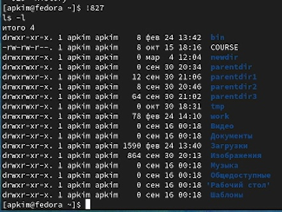

---
## Front matter
lang: ru-RU
title: Отчет по лабораторной работе №4
subtitle: Основы интерфейса взаимодействия пользователя с системой Unix на уровне командной строки
author:
  - Ким А.П.
institute:
  - Российский университет дружбы народов, Москва, Россия
date: 4 марта 2023 год

## i18n babel
babel-lang: russian
babel-otherlangs: english

## Formatting pdf
toc: false
toc-title: Содержание
slide_level: 2
aspectratio: 169
section-titles: true
theme: metropolis
header-includes:
 - \metroset{progressbar=frametitle,sectionpage=progressbar,numbering=fraction}
 - '\makeatletter'
 - '\beamer@ignorenonframefalse'
 - '\makeatother'
---

# Информация

## Докладчик

:::::::::::::: {.columns align=center}
::: {.column width="70%"}

  * Ким Ангелина Павловна
  * студент
  * направление "Математика и механика"
  * Российский университет дружбы народов

:::
::: {.column width="30%"}

:::
::::::::::::::

# Вводная часть

## Цели и задачи

Приобретение практических навыков взаимодействия пользователя с системой посредством командной строки.

## Выполнение работы 

Определяем полное имя домашнего каталога (рис.1)

## Выполнение работы 

Переходим в каталог /tmp (рис.2)

## Выполнение работы 

Выполняем команду ls -l (и другие) (рис.3)

## Выполнение работы 

Определяем есть ли в каталоге /var/spool подкаталог с именем cron (рис.4)

## Выполнение работы 

Создаем новый каталог newdir (рис.5)

## Выполнение работы 

Создаем в нем новые каталоги, а потом пробуем удалить это (рис.6)

## Выполнение работы 

С помощью команды man находим опцию позволяющую найти информацию для просмотра содержимого не только указанного каталога, но и подкаталогов, входящих в него (рис.7)

## Выполнение работы 

С помощью команды man находим набор опций, позволяющий отсортировать по времени последнего изменения выводимый список содержимого каталога с развернутым описанием файлов (рис.8)

## Выполнение работы 

Используем команду history (рис.9)

## Выполнение работы 

Модифицируем  (рис.10)

## Вывод

В ходе данной лабораторной работы мы приобрели навыки взаимодействия пользователя с системой посредством командной строки.

:::

