---
## Front matter
title: "Отчет по лабораторной работе №4"
subtitle: "Дисциплина: Компьютерные науки и технологии программирования"
author: "Ангелина Павловна Ким"

## Generic otions
lang: ru-RU
toc-title: "Содержание"

## Bibliography
bibliography: bib/cite.bib
csl: pandoc/csl/gost-r-7-0-5-2008-numeric.csl

## Pdf output format
toc: true # Table of contents
toc-depth: 2
lof: true # List of figures
lot: true # List of tables
fontsize: 12pt
linestretch: 1.5
papersize: a4
documentclass: scrreprt
## I18n polyglossia
polyglossia-lang:
  name: russian
  options:
	- spelling=modern
	- babelshorthands=true
polyglossia-otherlangs:
  name: english
## I18n babel
babel-lang: russian
babel-otherlangs: english
## Fonts
mainfont: PT Serif
romanfont: PT Serif
sansfont: PT Sans
monofont: PT Mono
mainfontoptions: Ligatures=TeX
romanfontoptions: Ligatures=TeX
sansfontoptions: Ligatures=TeX,Scale=MatchLowercase
monofontoptions: Scale=MatchLowercase,Scale=0.9
## Biblatex
biblatex: true
biblio-style: "gost-numeric"
biblatexoptions:
  - parentracker=true
  - backend=biber
  - hyperref=auto
  - language=auto
  - autolang=other*
  - citestyle=gost-numeric
## Pandoc-crossref LaTeX customization
figureTitle: "Рис."
tableTitle: "Таблица"
listingTitle: "Листинг"
lofTitle: "Список иллюстраций"
lotTitle: "Список таблиц"
lolTitle: "Листинги"
## Misc options
indent: true
header-includes:
  - \usepackage{indentfirst}
  - \usepackage{float} # keep figures where there are in the text
  - \floatplacement{figure}{H} # keep figures where there are in the text
---

# Цель работы

Приобретение практических навыков взаимодействия пользователя с системой посредством командной строки.

# Выполнение лабораторной работы

Определяем полное имя нашего домашнего каталога (рис. @fig:001).

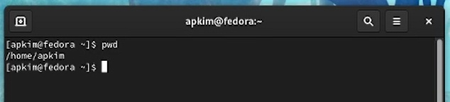{#fig:001 width=70%}

Переходим в каталог /tmp и выводим на экран его содержимое (рис. @fig:002).

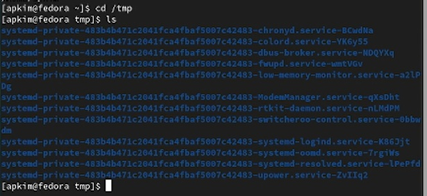{#fig:002 width=70%}

Используем команду ls -a, для того чтобы посмотреть скрытые файлы (рис. @fig:003).

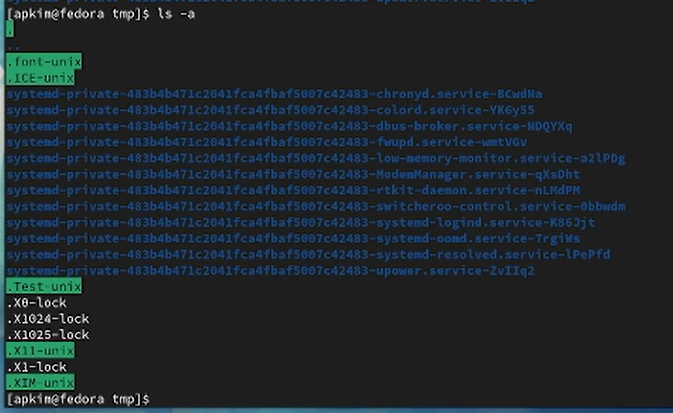{#fig:003 width=70%}

Используем команду ls -l, для того чтобы вывести на экран подробную информацию о файлах и каталогах (рис. @fig:004).

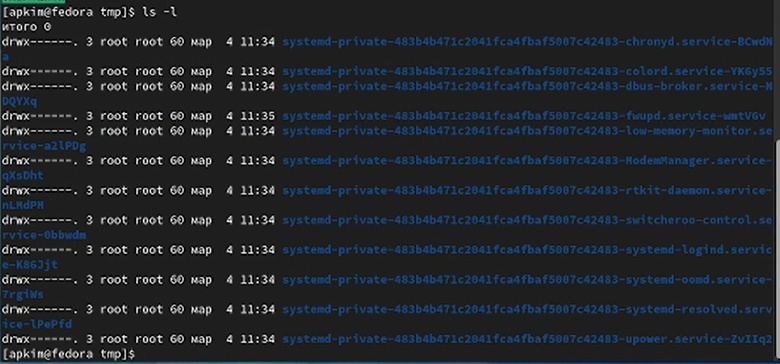{#fig:004 width=70%}

Используем команду ls -alF (рис. @fig:005).

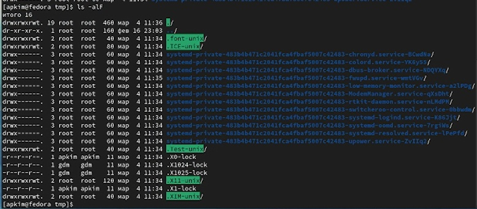{#fig:005 width=70%}

Используем команду ls -F (рис. @fig:006).

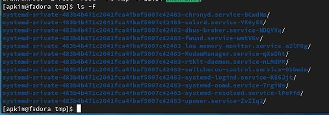{#fig:006 width=70%}

Проверяем есть ли в каталоге /var/spool подкаталог с именем cron. Ответ: нет, такого подкаталога нет. (рис. @fig:007).

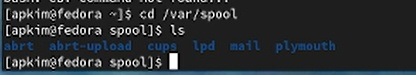{#fig:007 width=70%}

Переходим в домашний каталог и выводим на экран его содержимое, определяем кто является владельцем файлов и подкаталогов (рис. @fig:008).

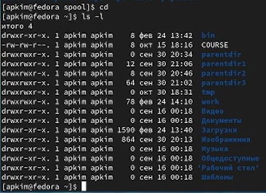{#fig:008 width=70%}

В домашнем каталоге создаем каталог с именем newdir (рис. @fig:009).

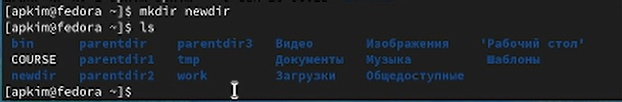{#fig:009 width=70%}

В каталоге ~/newdir создаем новый каталог с именем morefun (рис. @fig:0010).

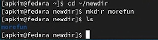{#fig:0010 width=70%}

В домашнем каталоге создаем одной командой три новых каталога с именами letters,memos,misk (рис. @fig:0011).

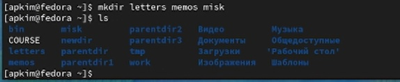{#fig:0011 width=70%}

Удаляем только что созданные каталоги (рис. @fig:0012).

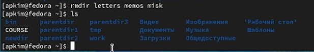{#fig:0012 width=70%}

Удаляем ранее созданный каталог ~/newdir  (рис. @fig:0013).

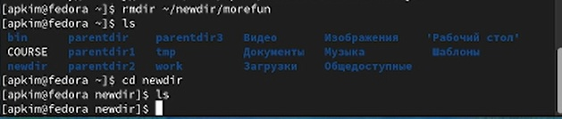{#fig:0013 width=70%}

С помощью команды man  определяем опцию, благодаря которой можно посмотреть содержимое не только указанного каталога, но и подкаталогов, входящих в него (рис. @fig:0014).

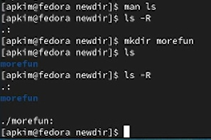{#fig:0014 width=70%}

С помощью команды man определяем набор опций, благодаря которым можно отсортировать по времени последнего изменения выводимый список содержимого каталога с развернутым описанием файлов (рис. @fig:0015).

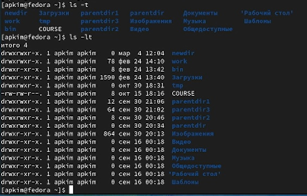{#fig:0015 width=70%}

Используем команду man cd (рис. @fig:0016).

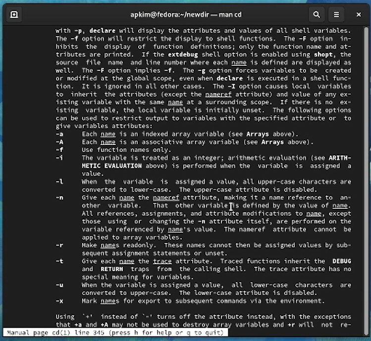{#fig:0016 width=70%}

Используем команду man pwd (рис. @fig:0017).

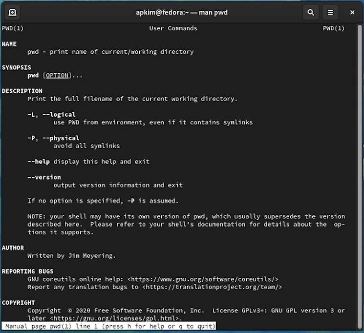{#fig:0017 width=70%}

Используем команду man mkdir (рис. @fig:0018).

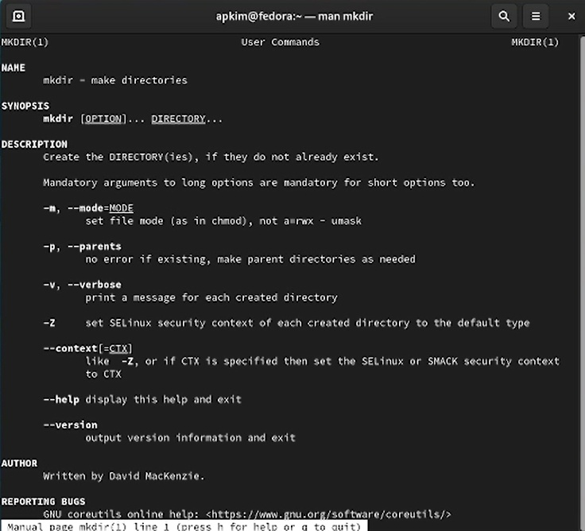{#fig:0018 width=70%}

Используя команду history, проверяем команду 827 (рис. @fig:0019).

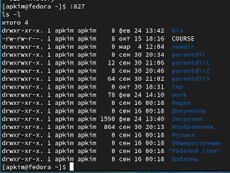{#fig:0019 width=70%}

Выполняем модификацию (рис. @fig:0020).

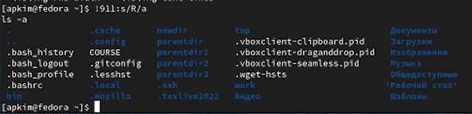{#fig:0020 width=70%}

# Выводы

В ходе данной лабораторной работы мы приобрели практические навыки взаимодействия пользователя с системой посредством командной строки.

# Список литературы{.unnumbered}

::: {#refs}
:::
