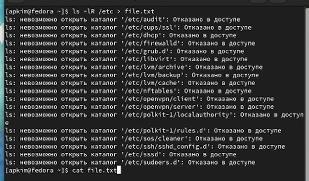
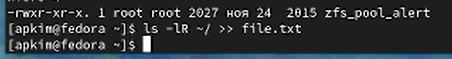
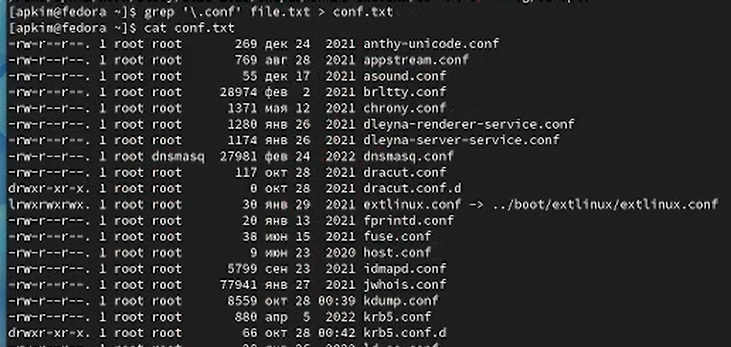
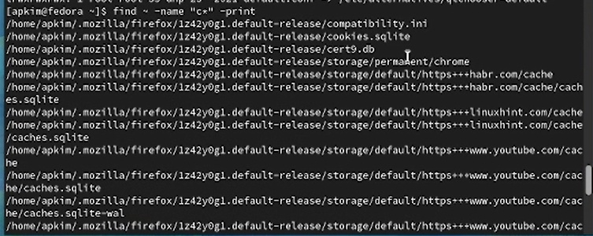
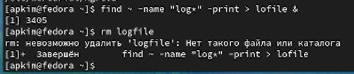
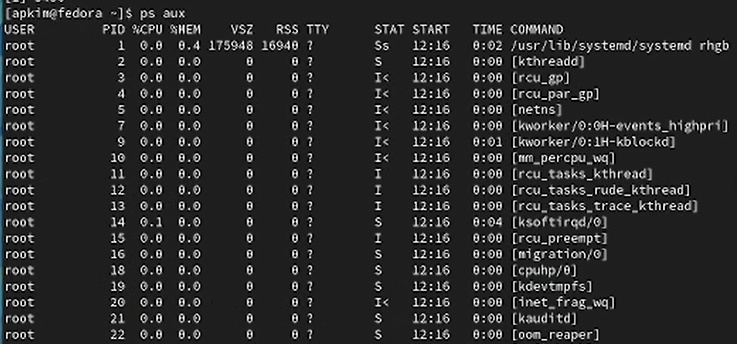
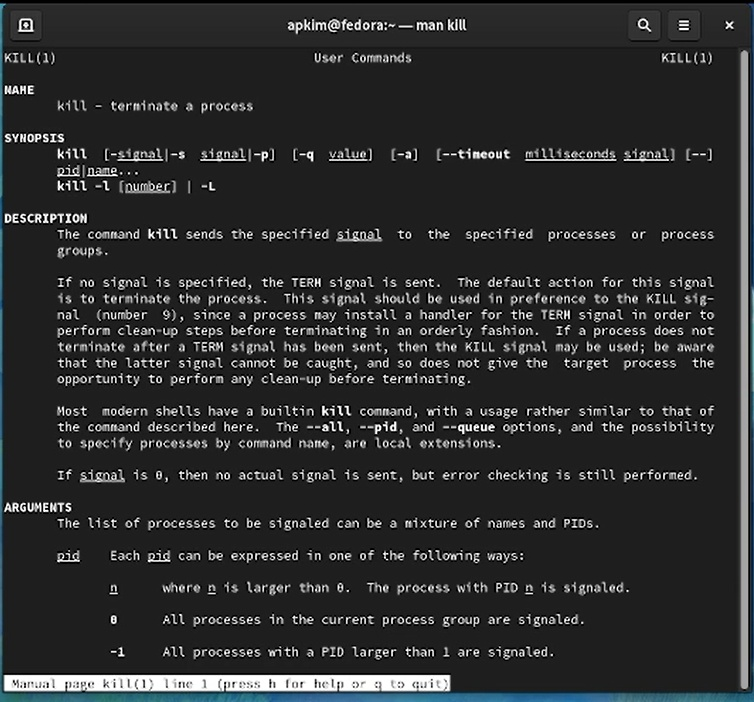
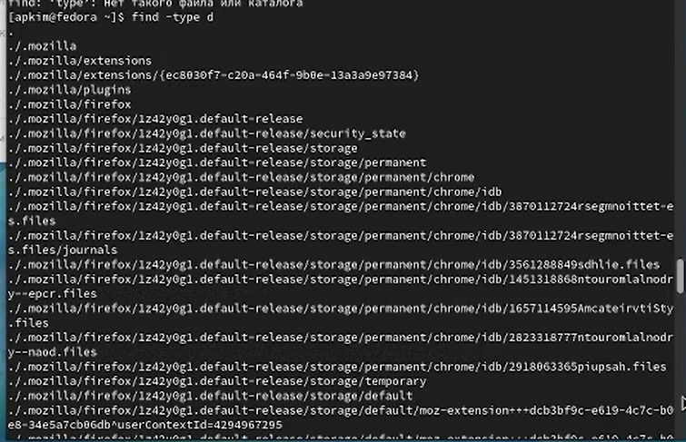

---
## Front matter
lang: ru-RU
title: Отчет по лабораторной работе №6
subtitle: Поиск файлов. Перенаправление ввода-вывода. Просмотр запущенных процессов
author:
  - Ким А.П.
institute:
  - Российский университет дружбы народов, Москва, Россия
date: 15 марта 2023 год

## i18n babel
babel-lang: russian
babel-otherlangs: english

## Formatting pdf
toc: false
toc-title: Содержание
slide_level: 2
aspectratio: 169
section-titles: true
theme: metropolis
header-includes:
 - \metroset{progressbar=frametitle,sectionpage=progressbar,numbering=fraction}
 - '\makeatletter'
 - '\beamer@ignorenonframefalse'
 - '\makeatother'
---

# Информация

## Докладчик

:::::::::::::: {.columns align=center}
::: {.column width="70%"}

  * Ким Ангелина Павловна
  * студент
  * направление "Математика и механика"
  * Российский университет дружбы народов

:::
::: {.column width="30%"}

:::
::::::::::::::

# Вводная часть

## Цели и задачи

Ознакомление с инструментами поиска файлов и фильтрации текстовых данных. Приобретение практических навыков: по управлению процессами (и заданиями), по проверке использования диска и обслуживанию файловых систем.

## Выполнение работы 

Сначала записываем в файл file.txt названия файлов, содержащихся в каталоге /etc (рис.1)

## Выполнение работы 

Дописываем в этот же файл названия файлов, содержащихся в нашем домашнем каталоге (рис.2)

## Выполнение работы 

Выводим названия файлов с расширением .conf (рис.3)

## Выполнение работы 

Записываем эти файлы в текстовый файл conf.txt (рис.4)

## Выполнение работы 

Определяем, какие файлы в домашнем каталоге имеют имена, начинавшиеся с символа с (рис.5)

## Выполнение работы 

Выводим на экран имена файлов, начинающиеся с символа h (рис.6)

## Выполнение работы 

Запускаем в фоновом режиме процесс, который будет записывать в файл ~/logfile файлы, имена которых начинаются с log, удаляем файл ~/logfile (рис.7)

## Выполнение работы 

Определяем идентификатор процесса gedit (рис.8)

## Выполнение работы 

Далее просматриваем справку команды man kill (рис.9)

## Выполнение работы 

Команда "find -type d" (рис.10)

## Вывод

В ходе данной лабораторной работы мы ознакомились с инструментами поиска файлов и фильтрации текстовых данных.

:::

