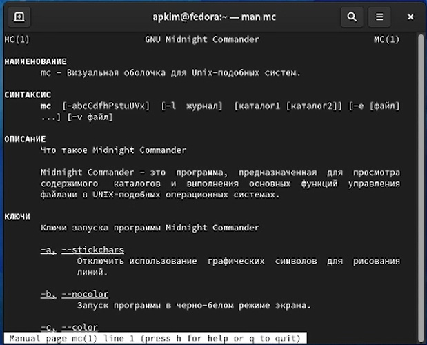
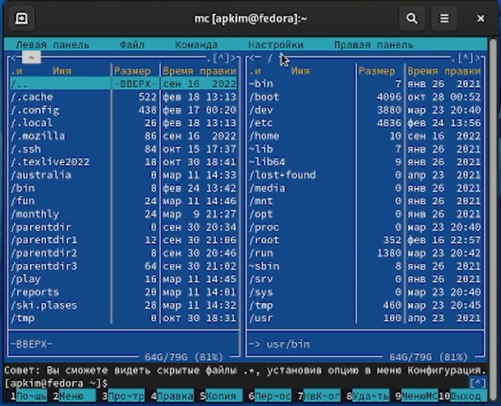
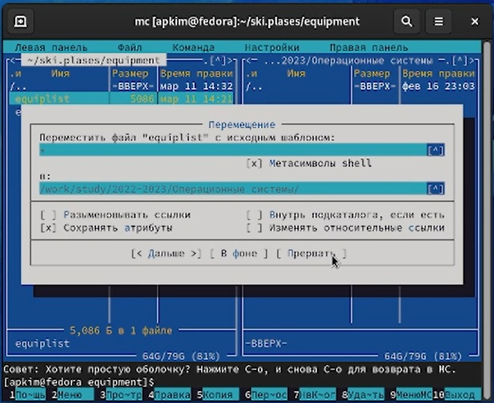
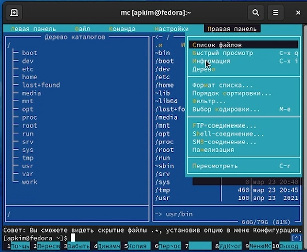
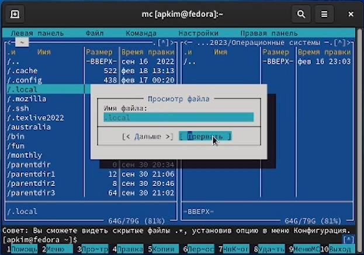
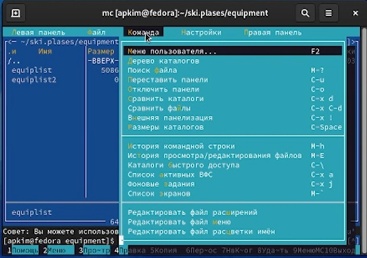
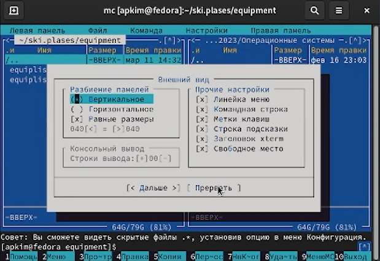
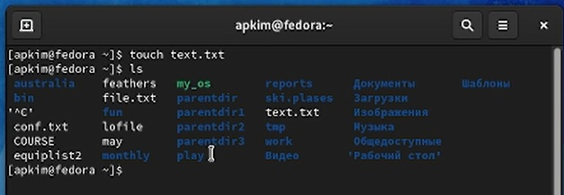
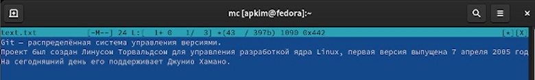
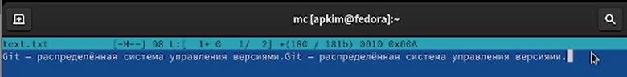

---
## Front matter
lang: ru-RU
title: Отчет по лабораторной работе №7
subtitle: Командная оболочка Midnight Commander
author:
  - Ким А.П.
institute:
  - Российский университет дружбы народов, Москва, Россия
date: 23 марта 2023 год

## i18n babel
babel-lang: russian
babel-otherlangs: english

## Formatting pdf
toc: false
toc-title: Содержание
slide_level: 2
aspectratio: 169
section-titles: true
theme: metropolis
header-includes:
 - \metroset{progressbar=frametitle,sectionpage=progressbar,numbering=fraction}
 - '\makeatletter'
 - '\beamer@ignorenonframefalse'
 - '\makeatother'
---

# Информация

## Докладчик

:::::::::::::: {.columns align=center}
::: {.column width="70%"}

  * Ким Ангелина Павловна
  * студент
  * направление "Математика и механика"
  * Российский университет дружбы народов

:::
::: {.column width="30%"}

:::
::::::::::::::

# Вводная часть

## Цели и задачи

Освоение основных возможностей командной оболочки Midnight Commander. Приобретение навыков практической работы по просмотру каталогов и файлов; манипуляций с ними.

## Выполнение работы 

Изучили информацию о mc, вызвав в командной строке man mc (рис.1)

## Выполнение работы 

Запустили из командной строки mc (рис.2)

## Выполнение работы 

Выполняем несколько операций в mc, используя управляющие клавиши. Например, операция перемещения файла (рис.3)

## Выполнение работы 

Выполняем основные команды меню левой (правой) панели (рис.4)

## Выполнение работы 

Используя возможности подменю "Файл", выполняем: например, просмотр содержимого текстового файла (рис.5)

## Выполнение работы 

Далее изучаем подменю "Команда" (рис.6)

## Выполнение работы 

Вызовим подменю "Настройки", изучим внешний вид командной оболочки (рис.7)

## Выполнение работы 

Далее создаем текстовый файл (рис.8)

## Выполнение работы 

Вставляем в него текст из Интернета (рис.9)

## Выполнение работы 

Проделываем с текстом манипуляции: удаляем строку текста, выделяем фрагмент текста, выделяем фрагмент текста и переносим его на новую строку, сохраняем файл. (рис.10)

## Вывод

В ходе выполнения лабораторной работы мы освоили основные возможности командной оболочки Midnight Commander.

:::

