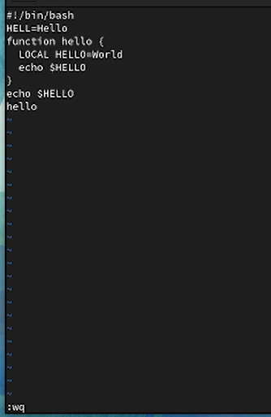

---
## Front matter
lang: ru-RU
title: Отчет по лабораторной работе №8
subtitle: Текстовый редактор vi
author:
  - Ким А. П.
institute:
  - Российский университет дружбы народов, Москва, Россия
date: 01 апреля 2023 год

## i18n babel
babel-lang: russian
babel-otherlangs: english

## Formatting pdf
toc: false
toc-title: Содержание
slide_level: 2
aspectratio: 169
section-titles: true
theme: metropolis
header-includes:
 - \metroset{progressbar=frametitle,sectionpage=progressbar,numbering=fraction}
 - '\makeatletter'
 - '\beamer@ignorenonframefalse'
 - '\makeatother'
---

# Информация

## Докладчик

:::::::::::::: {.columns align=center}
::: {.column width="70%"}

  * Ким Ангелина Павловна
  * студент
  * направление "Математика и механика"
  * Российский университет дружбы народов

:::
::: {.column width="30%"}

:::
::::::::::::::

# Вводная часть

## Цели и задачи

Познакомиться с операционной системой Linux. Получить практические навыки работы с редактором vi, установленным по умолчанию практически во всех дистрибутивах.

## Выполнение работы 

Создаем каталог (рис.1)

## Выполнение работы 

Вызываем vi и создаем файл hello.sh (рис.2)

## Выполнение работы 

Сделаем файл исполняемым (рис.3)

## Выполнение работы 

Устанавливаем курсор в конец слова HELL второй строки, заменяем это слово на HELLO (рис.4)

## Выполнение работы 

Устанавливаем курсор на четвертую строку и стираем слово LOCAL (рис.5)

## Выполнение работы 

Переходим в режим вставки и набираем текст: local (рис.6)

## Выполнение работы 

Устанавливаем курсор на последней строке файла, вставляем после нее новый текст (рис.7)

## Выполнение работы 

Удаляем последнюю строку (рис.8)

## Выполнение работы 

Вводим команду отмены изменений и сохраняем все изменения (рис.9)

## Вывод

В ходе выполнения данной лабораторной работы мы получили практические навыки работы с редактором vi.

:::

