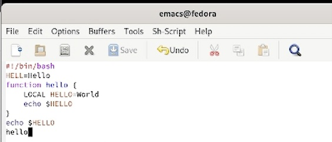
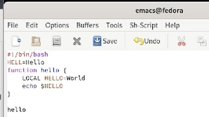
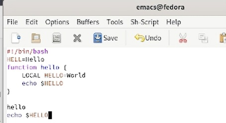
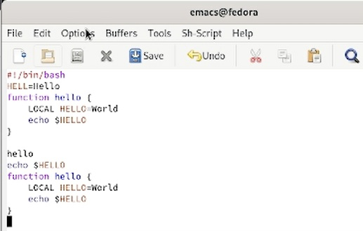
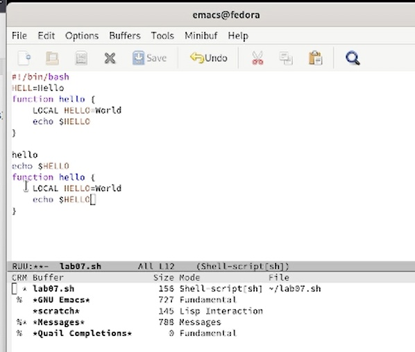
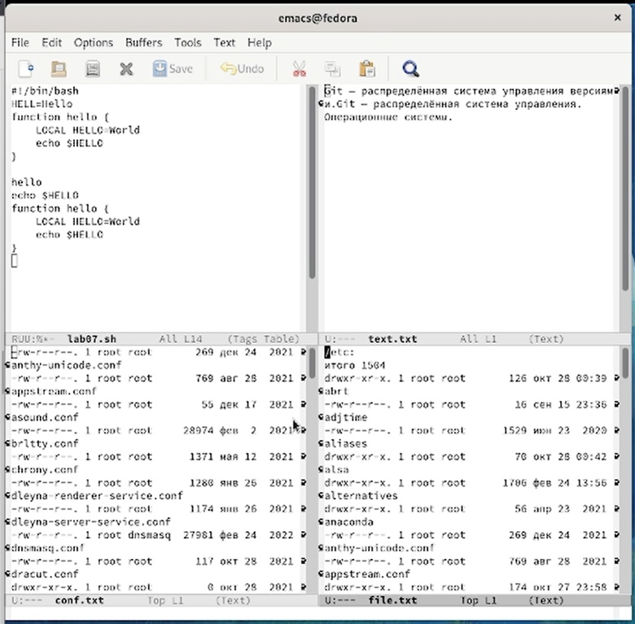

---
## Front matter
lang: ru-RU
title: Отчет по лабораторной работе №9
subtitle: Текстовый редактор emacs
author:
  - Ким А. П.
institute:
  - Российский университет дружбы народов, Москва, Россия
date: 08 апреля 2023 год

## i18n babel
babel-lang: russian
babel-otherlangs: english

## Formatting pdf
toc: false
toc-title: Содержание
slide_level: 2
aspectratio: 169
section-titles: true
theme: metropolis
header-includes:
 - \metroset{progressbar=frametitle,sectionpage=progressbar,numbering=fraction}
 - '\makeatletter'
 - '\beamer@ignorenonframefalse'
 - '\makeatother'
---

# Информация

## Докладчик

:::::::::::::: {.columns align=center}
::: {.column width="70%"}

  * Ким Ангелина Павловна
  * студент
  * направление "Математика и механика"
  * Российский университет дружбы народов

:::
::: {.column width="30%"}

:::
::::::::::::::

# Вводная часть

## Цели и задачи

Получить практические навыки работы с редактором Emacs.

## Выполнение работы 

Создаем файл и набираем туда текст (рис.1)

## Выполнение работы 

Сохраняем текст, а затем вырезаем одной командой целую строку (рис.2)

## Выполнение работы 

Вставляем эту строку в конец файла (рис.3)

## Выполнение работы 

Выделяем область в буфер обмена, вставляем эту область в конец файла (рис.4)

## Выполнение работы 

Выводим на экран список активных буферов (рис.5)

## Выполнение работы 

Поделим фрейм на 4 части  (рис.6)

## Вывод

Получили практические навыки работы с текстовым редактором Emacs.

:::

