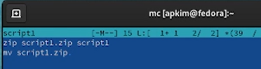
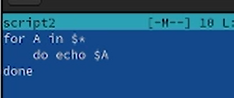
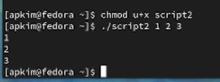
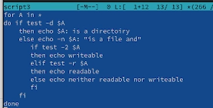
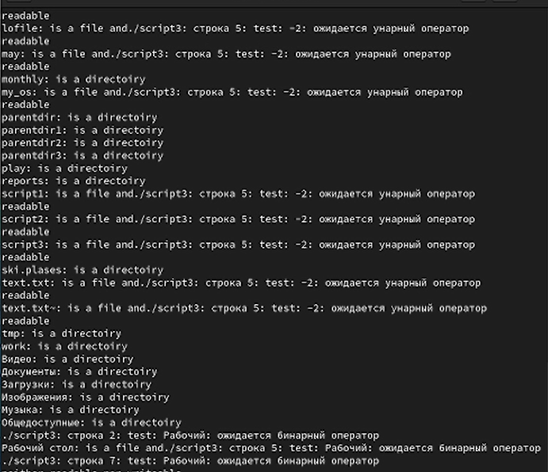
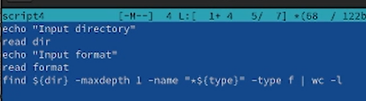
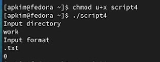

---
## Front matter
lang: ru-RU
title: Отчет по лабораторной работе №10
subtitle: Программирование в командном процессоре OC UNIX. Командные файлы
author:
  - Ким А. П.
institute:
  - Российский университет дружбы народов, Москва, Россия
date: 10 апреля 2023 год

## i18n babel
babel-lang: russian
babel-otherlangs: english

## Formatting pdf
toc: false
toc-title: Содержание
slide_level: 2
aspectratio: 169
section-titles: true
theme: metropolis
header-includes:
 - \metroset{progressbar=frametitle,sectionpage=progressbar,numbering=fraction}
 - '\makeatletter'
 - '\beamer@ignorenonframefalse'
 - '\makeatother'
---

# Информация

## Докладчик

:::::::::::::: {.columns align=center}
::: {.column width="70%"}

  * Ким Ангелина Павловна
  * студент
  * направление "Математика и механика"
  * Российский университет дружбы народов

:::
::: {.column width="30%"}

:::
::::::::::::::

# Вводная часть

## Цели и задачи

Изучить основы программирования в оболочке OC UNIX/Linux. Научиться писать небольшие командные файлы.

## Выполнение работы 

Пишем первый скрипт, который при запуске будет делать резервную копию самого себя в другую директорию в нашем домашнем каталоге. При этом файл должен архивироваться одним из архиваторов на выбор. (рис.1)

## Выполнение работы 

Проверка первого скрипта (рис.2)

## Выполнение работы 

Пишем второй скрипт (рис.3)

## Выполнение работы 

Проверка второго скрипта (рис.4)

## Выполнение работы 

Пишем третий скрипт (рис.5)

## Выполнение работы 

Проверка третьего скрипта (рис.6)

## Выполнение работы 

Пишем четвертый скрипт (рис.7)

## Выполнение работы 

Проверка четвертого скрипта (рис.8)

## Вывод

В ходе выполнения данной лабораторной работы мы научились писать небольшие командные файлы.

:::

