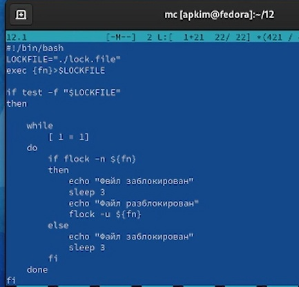
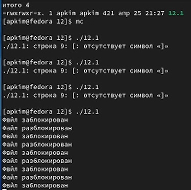
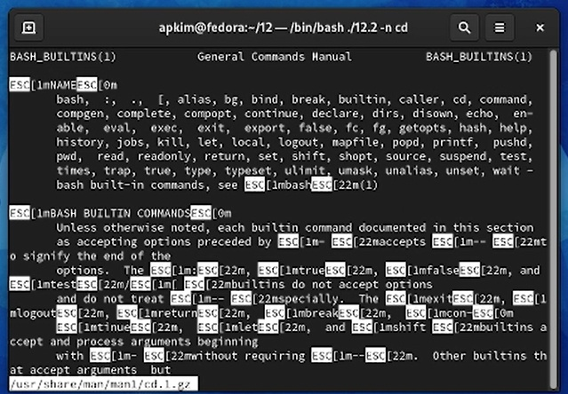
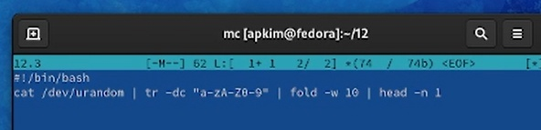
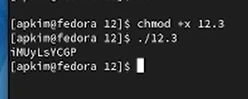

---
## Front matter
lang: ru-RU
title: Отчет по лабораторной работе №12
subtitle: Программирование в командном процессоре OC UNIX. Расширенное программирование
author:
  - Ким А. П.
institute:
  - Российский университет дружбы народов, Москва, Россия
date: 25 апреля 2023 год

## i18n babel
babel-lang: russian
babel-otherlangs: english

## Formatting pdf
toc: false
toc-title: Содержание
slide_level: 2
aspectratio: 169
section-titles: true
theme: metropolis
header-includes:
 - \metroset{progressbar=frametitle,sectionpage=progressbar,numbering=fraction}
 - '\makeatletter'
 - '\beamer@ignorenonframefalse'
 - '\makeatother'
---

# Информация

## Докладчик

:::::::::::::: {.columns align=center}
::: {.column width="70%"}

  * Ким Ангелина Павловна
  * студент
  * Российский университет дружбы народов

:::
::: {.column width="30%"}

:::
::::::::::::::

# Вводная часть

## Цели и задачи

Научиться писать программы.

## Выполнение работы 

Первая программа (рис.1)

## Выполнение работы 

Выполнение первой программы (рис.2)

## Выполнение работы 

Вторая программа (рис.3)

## Выполнение работы 

Выполнение второй программы (рис.4)

## Выполнение работы 

Третья программа (рис.5)

## Выполнение работы 

Выполнение третьей программы (рис.6)

## Вывод

В ходе выполенения данной лабораторной работы мы научились писать программы.

:::

