---
## Front matter
title: "Отчет первого этапа индивидуального проекта"
subtitle: "Дисциплина: Компьютерные науки и технологии программирования"
author: "Ангелина Павловна Ким"

## Generic otions
lang: ru-RU
toc-title: "Содержание"

## Bibliography
bibliography: bib/cite.bib
csl: pandoc/csl/gost-r-7-0-5-2008-numeric.csl

## Pdf output format
toc: true # Table of contents
toc-depth: 2
lof: true # List of figures
lot: true # List of tables
fontsize: 12pt
linestretch: 1.5
papersize: a4
documentclass: scrreprt
## I18n polyglossia
polyglossia-lang:
  name: russian
  options:
	- spelling=modern
	- babelshorthands=true
polyglossia-otherlangs:
  name: english
## I18n babel
babel-lang: russian
babel-otherlangs: english
## Fonts
mainfont: PT Serif
romanfont: PT Serif
sansfont: PT Sans
monofont: PT Mono
mainfontoptions: Ligatures=TeX
romanfontoptions: Ligatures=TeX
sansfontoptions: Ligatures=TeX,Scale=MatchLowercase
monofontoptions: Scale=MatchLowercase,Scale=0.9
## Biblatex
biblatex: true
biblio-style: "gost-numeric"
biblatexoptions:
  - parentracker=true
  - backend=biber
  - hyperref=auto
  - language=auto
  - autolang=other*
  - citestyle=gost-numeric
## Pandoc-crossref LaTeX customization
figureTitle: "Рис."
tableTitle: "Таблица"
listingTitle: "Листинг"
lofTitle: "Список иллюстраций"
lotTitle: "Список таблиц"
lolTitle: "Листинги"
## Misc options
indent: true
header-includes:
  - \usepackage{indentfirst}
  - \usepackage{float} # keep figures where there are in the text
  - \floatplacement{figure}{H} # keep figures where there are in the text
---

# Цель работы

Научиться создавать сайт.

# Выполнение лабораторной работы

Первым делом скачиваем архив с репозитория (рис. @fig:001).

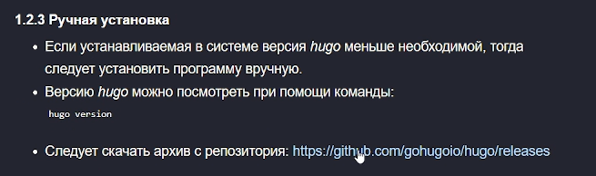{#fig:001 width=70%}

Скачиваем нужную версию на Linux (рис. @fig:002).

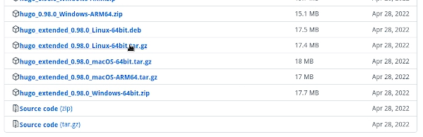{#fig:002 width=70%}

Далее создаем по шаблону новый репозиторий  (рис. @fig:003).

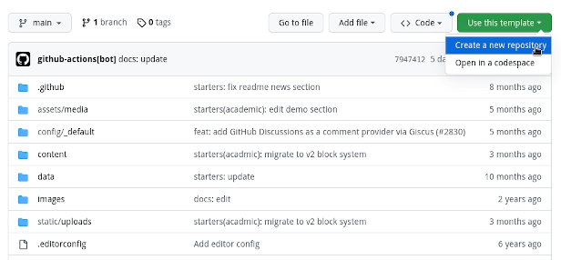{#fig:003 width=70%}

Теперь указываем имя репозитория (рис. @fig:004).

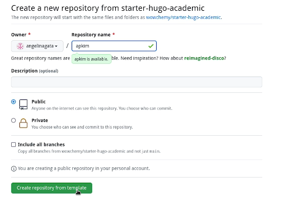{#fig:004 width=70%}

Для тог чтобы клонировать репозиторий, копируем ссылку (рис. @fig:005).

{#fig:005 width=70%}

Клонируем репозиторий через консоль (рис. @fig:006).

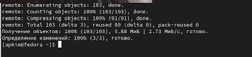{#fig:006 width=70%}

Далее переходим в папку "apkim" (название нового репозитория), там мы можем посмотреть наши файлы (рис. @fig:007).

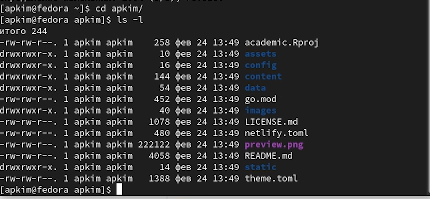{#fig:007 width=70%}

Далее выполняем команду "~/bin/hugo" (рис. @fig:008).

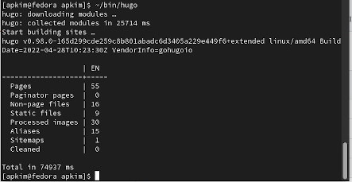{#fig:008 width=70%}

Еще раз просмотрим файлы в папке (рис. @fig:009).

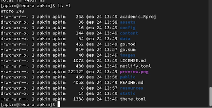{#fig:009 width=70%}

Теперь нам нужно удалить каталог "public", потому что пока он нам не нужен, мы его создадим позже (рис. @fig:0010).

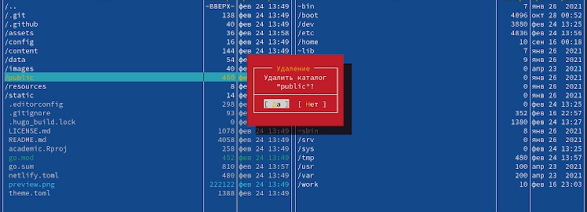{#fig:0010 width=70%}

Теперь выполняем команду "~/bin/hugo server", и если далее копируем ссылку, переходим по ней в браузере. Мы видим сайт, но мы можем открыть его только на данном компьютере, никто в интернете не сможет увиидеть этот сайт (рис. @fig:0011).

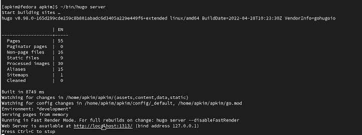{#fig:0011 width=70%}

Далее переходим в github, чтобы создать еще один репозиторий, который должен называться так же, как имя пользователя на github (рис. @fig:0012).

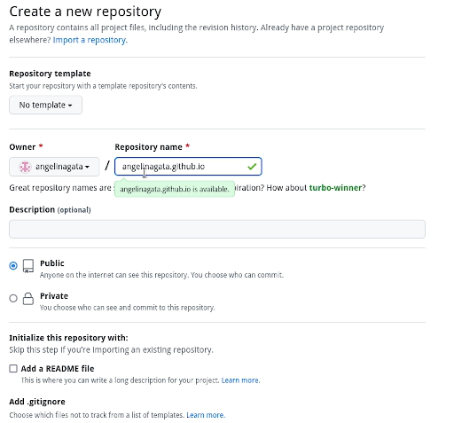{#fig:0012 width=70%}

Далее снова просматриваем файлы (рис. @fig:0013).

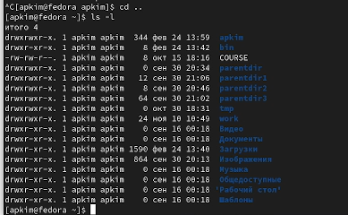{#fig:0013 width=70%}

Клонируем новый репозиторий через консоль (рис. @fig:0014).

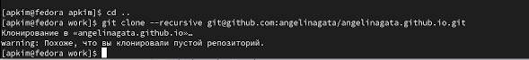{#fig:0014 width=70%}

Далее создаем ветку, так как репозиторий пустой (рис. @fig:0015).

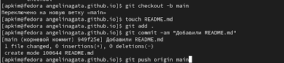{#fig:0015 width=70%}

Теперь нам нужно выполнить команду "git submodule ...", и автоматически создастся каталог public (рис. @fig:0016).

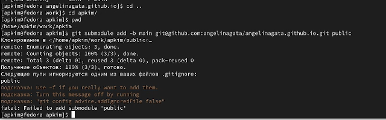{#fig:0016 width=70%}

Закомментируем каталог public, и проделаем предыдущий шаг еще раз (рис. @fig:0017).

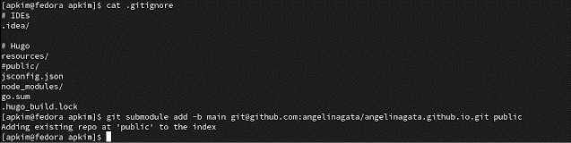{#fig:0017 width=70%}

Далее проделываем еще раз команду "~/bin/hugo", автоматически в папке public появились файлы  (рис. @fig:0018).

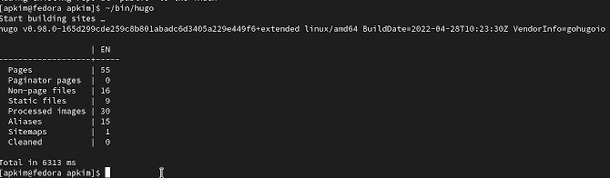{#fig:0018 width=70%}

Возвращаемся в public, делаем "git remote -v" для проверки, что этот каталог подключен к нашему репозиторию (рис. @fig:0019).

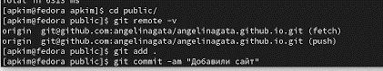{#fig:0019 width=70%}

Отправляем файлы на github (рис. @fig:0020).

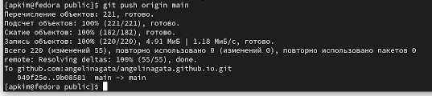{#fig:0020 width=70%}

Переходим на сайт (рис. @fig:0021).

{#fig:0021 width=70%}

# Выводы

Первый этап индивидуального проекта выполнен.

# Список литературы{.unnumbered}

::: {#refs}
:::
