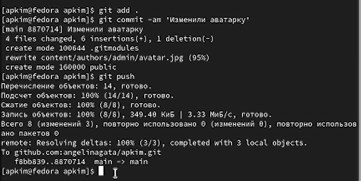
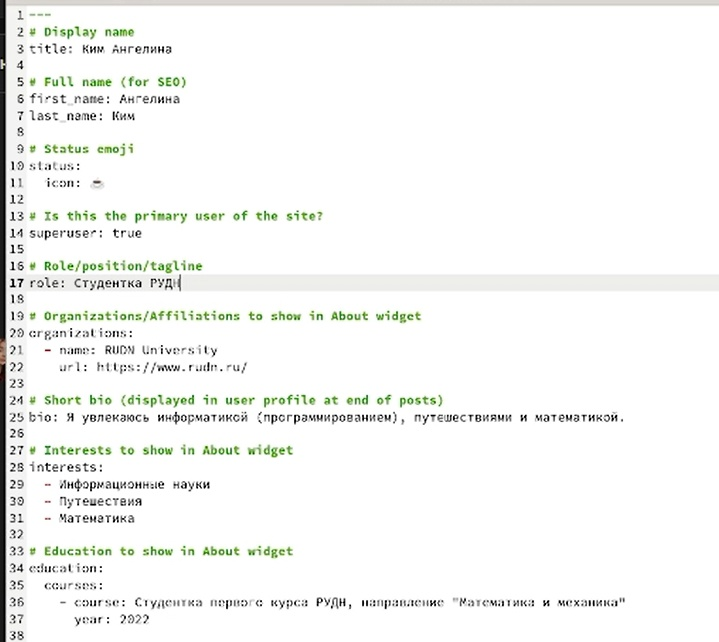
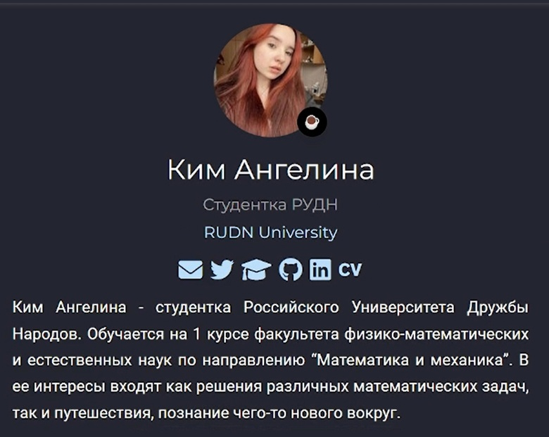
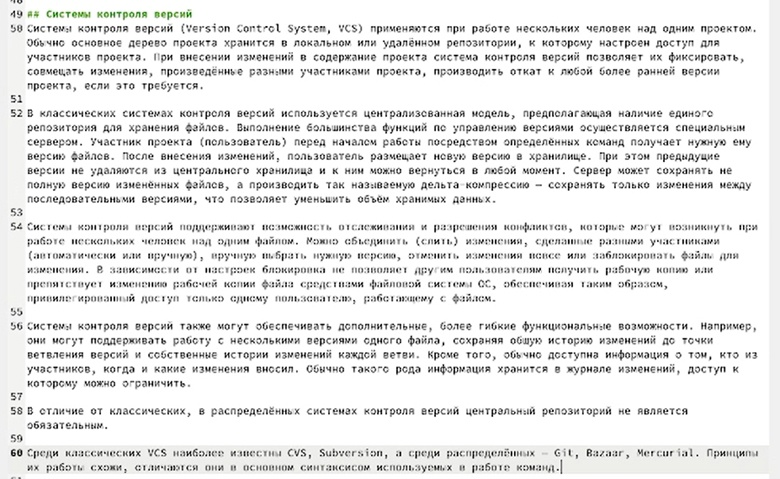
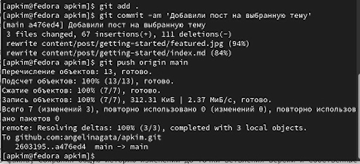
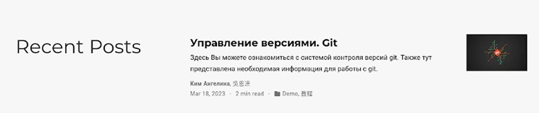
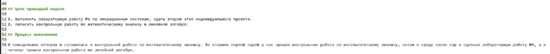
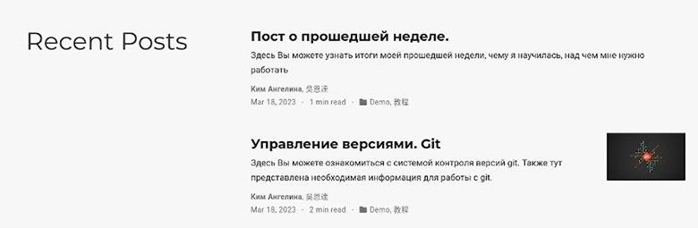

---
## Front matter
lang: ru-RU
title: Отчет индивидуального проекта 
subtitle: Второй этап
author:
  - Ким А.П.
institute:
  - Российский университет дружбы народов, Москва, Россия
  - Объединённый институт ядерных исследований, Дубна, Россия
date: 18 марта 2023

## i18n babel
babel-lang: russian
babel-otherlangs: english

## Formatting pdf
toc: false
toc-title: Содержание
slide_level: 2
aspectratio: 169
section-titles: true
theme: metropolis
header-includes:
 - \metroset{progressbar=frametitle,sectionpage=progressbar,numbering=fraction}
 - '\makeatletter' 
 - '\beamer@ignorenonframefalse'
 - '\makeatother'
---

## Докладчик

:::::::::::::: {.columns align=center}
::: {.column width="70%"}

  * Ким Ангелина Павловна
  * студент
  * направление "Математика и механика"
  * Российский университет дружбы народов

:::
::: {.column width="30%"}

:::
::::::::::::::

# Элементы презентации

## Цели и задачи
Создание индивидуального сайта.

## Выполнение работы

Сначала загружаем свою аватарку, которая будет высвечиваться на титульной странице сайта (рис. 1).

## Выполнение работы

Записываем данные о себе: изменяем биографию, сведения об образовании, заполняем свои интересы (рис. 2).

## Выполнение работы

Вот так выглядит начальная страница нашего сайта (рис. 3).

## Выполнение работы

Далее пишем пост по выбору. Я выбрала тему: "Системы контроля версий. Git" (рис. 4).

## Выполнение работы

Загружаем пост на сайт (рис. 5).

## Выполнение работы

Вот так выглядит пост по выбору на сайте (рис. 6.).

## Выполнение работы

Создание поста о прошедшей неделе (рис. 7).

## Выполнение работы

Вот так выглядит пост о прошедшей неделе на сайте (рис. 8).

## Итоговый слайд

Второй этап выполнен.

:::

