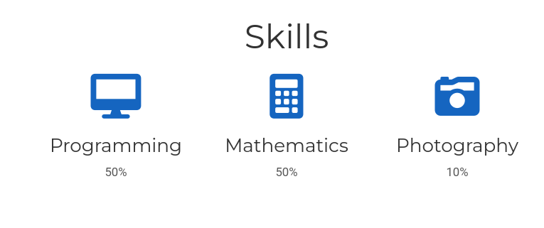
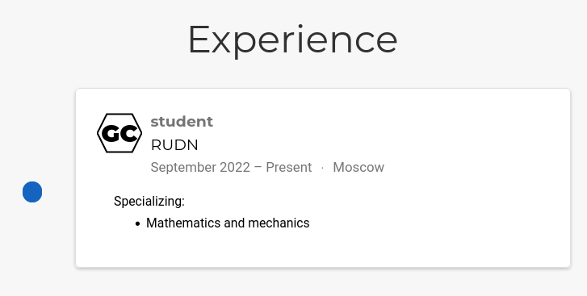
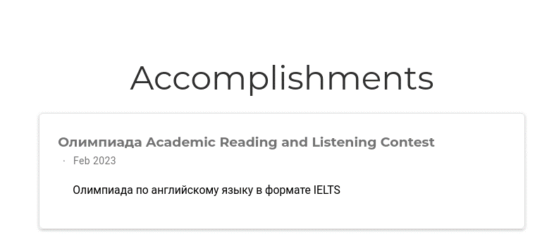
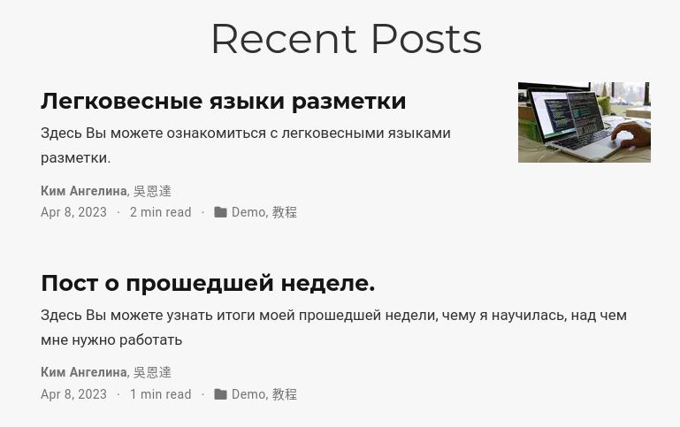
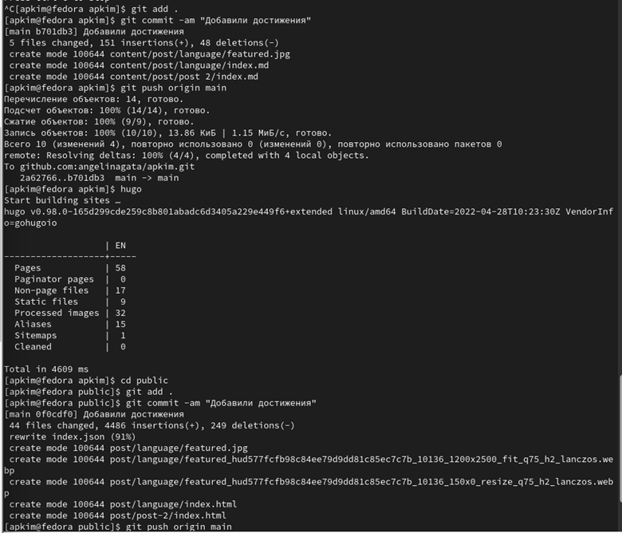

---
## Front matter
lang: ru-RU
title: Отчет индивидуального проекта 
subtitle: Третий этап
author:
  - Ким А.П.
institute:
  - Российский университет дружбы народов, Москва, Россия
  - Объединённый институт ядерных исследований, Дубна, Россия
date: 08 апреля 2023

## i18n babel
babel-lang: russian
babel-otherlangs: english

## Formatting pdf
toc: false
toc-title: Содержание
slide_level: 2
aspectratio: 169
section-titles: true
theme: metropolis
header-includes:
 - \metroset{progressbar=frametitle,sectionpage=progressbar,numbering=fraction}
 - '\makeatletter' 
 - '\beamer@ignorenonframefalse'
 - '\makeatother'
---

## Докладчик

:::::::::::::: {.columns align=center}
::: {.column width="70%"}

  * Ким Ангелина Павловна
  * студент
  * направление "Математика и механика"
  * Российский университет дружбы народов

:::
::: {.column width="30%"}

:::
::::::::::::::

# Элементы презентации

## Цели и задачи

Создание индивидуального сайта.

## Выполнение работы

Добавили информацию о своих навыках и умениях (рис. 1).

## Выполнение работы

Далее добавим информацию о своем опыте: поступление в университе (рис. 2).

## Выполнение работы

Добавим информацию о своих достижениях (рис. 3).

## Выполнение работы

Далее пишем два поста (рис. 4).

## Выполнение работы

Загружаем все на гитхаб (рис. 5).

## Итоговый слайд

Третий этап выполнен.

:::
